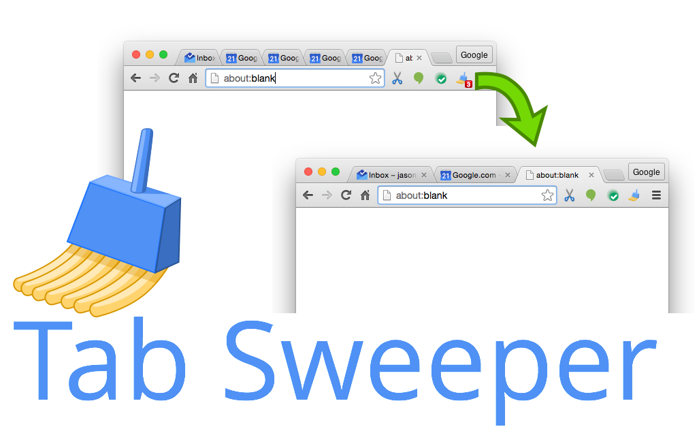

# TabSweeper

TabSweeper sweeps duplicate tabs in Google Chrome

## Installation Instructions

You need to side load the extension.

1. Clone the repo to your local machine
1. Open the "Manage extensions" window in Chrome (little puzzle piece icon)
2. Switch to "Developer mode"
1. Click the "Load Unpacked" button (top left)
1. Browse to the location in which you cloned this repo, and select the **extension** folder
1. Don't forget to "pin" the extension (it won't be pinned by default). Go to the same extensions (puzzle) icon and pin that shit
1. Live a better life

## Release Notes

 - v0.0.6
   - Removed redundant async closures

 - v0.0.5
   - Added bug report link

 - v0.0.4
   - Updated/fixed the data storage scheme (**WARNING!** This update will wipe out your saved settings. #yolo)
   - Added a patch system to update data storage across releases

 - v0.0.3
   - Added support for Manifest 3 async semantics

 - v0.0.2
   - Added version number to options screen
   - Added README

 - v0.0.1
   - Initial Release
